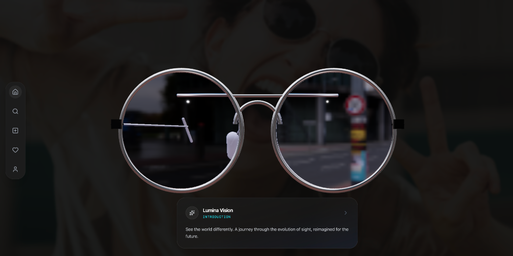

<div align="center">

# 👓 Lumina Vision: El Futuro de la Visión

### *Una experiencia 3D inmersiva que narra la evolución de las gafas desde 1286 hasta el futuro de la realidad aumentada*

[](https://smart-glasses-landing-threejs-gsap.vercel.app)
[](https://threejs.org/)
[](https://react.dev/)
[](https://greensock.com/gsap/)



[**Ver Demo en Vivo →**](https://smart-glasses-landing-threejs-gsap.vercel.app)

</div>

---

## ✨ Sobre el Proyecto

**Lumina Vision** es una landing page interactiva que combina storytelling visual con tecnología 3D de vanguardia. A través de un scroll cinematográfico, los usuarios viajan desde la invención de la "Piedra de Lectura" en el año 1200 d.C., pasando por los bifocales de Benjamin Franklin, hasta llegar a las gafas inteligentes del futuro con IA integrada.

### 🎯 Características Principales

- 🎬 **Narrativa Scroll-Driven**: Animaciones GSAP sincronizadas con el scroll
- 🕶️ **Modelo 3D Interactivo**: Gafas renderizadas con React Three Fiber
- 🎨 **HUD Dinámico**: Interfaz futurista que cambia según la época
- ⚡ **Optimización Automática**: Ajuste de calidad según el rendimiento del dispositivo
- �️ **Solo Desktop**: Experiencia optimizada para pantallas grandes

---

## 🛠️ Stack Tecnológico

| Tecnología | Propósito |
|------------|-----------|
| **React 19** | Framework UI moderno |
| **Vite** | Build tool ultrarrápido |
| **React Three Fiber** | Renderizado 3D declarativo |
| **@react-three/drei** | Helpers para R3F |
| **GSAP + ScrollTrigger** | Animaciones complejas |
| **Tailwind CSS** | Estilizado responsivo |
| **TypeScript** | Type safety |

---


## 📂 Estructura del Proyecto

```
src/
├── components/
│   ├── scene/              # Componentes 3D
│   │   └── Experience.tsx  # Orquestador de la escena 3D
│   ├── ui/                 # Componentes de interfaz
│   │   ├── NavRail.tsx     # Navegación lateral
│   │   ├── BackgroundLayer.tsx
│   │   ├── ContentLayer.tsx
│   │   └── MobileBlocker.tsx
│   ├── HUD.tsx             # Heads-Up Display
│   └── GlassesModel.tsx    # Modelo 3D de las gafas
├── data/
│   └── scenes.ts           # Contenido y configuración de escenas
├── hooks/
│   └── useSceneAnimation.ts # Lógica de animaciones GSAP
├── types.ts                # Definiciones TypeScript
└── App.tsx                 # Componente raíz
```


## 📸 Screenshots

<div align="center">

### Hero Section


*Experiencia inmersiva con modelo 3D interactivo*

</div>

---

## 👨‍💻 Autor

**Angel Arrieta** - [@anuidev8](https://github.com/anuidev8)

---

<div align="center">

### 🌟 Si te gustó el proyecto, dale una estrella!

[](https://github.com/anuidev8/smart-glasses-landing-threejs-gsap)

**[Ver Demo en Vivo →](https://smart-glasses-landing-threejs-gsap.vercel.app)**

</div>
